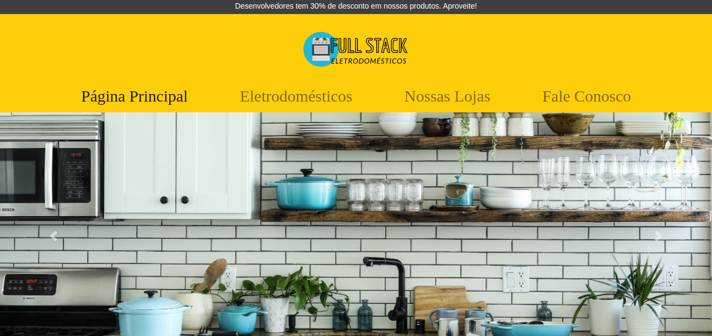

# Full Stack Eletro
A 'Full Stack Eletro - Node' é um projeto em React e Node.js    

   
<em>Programadores tem 30% de desconto em todos os produtos da loja!</em> :satisfied: 

## Índice
* [Sobre o projeto](#sobre-o-projeto)
* [Tech](#tecnologias)
* [Updates](#atualizações)

## Sobre o projeto
A 'Full Stack Eletro' é uma e-commerce especializada em eletrodomésticos sendo desenvolvida para o curso de Desenvolvimento Full Stack da Recode Pro. 
A cada módulo do curso serão implementadas novas tecnologias. Você pode conferir as tecnologias usadas até o momento na sessão abaixo. 

	
## Tecnologias
Atualmente rodando com:

- [x] React
- [x] Node.js
- [x] React-Bootstrap
- [x] Express

## Screenshots

	
	
## Atualizações
Algumas atualizações feitas na última versão e futuras implementações:

- [x] Layout repaginado
- [x] Refatoração do back-end para Node.js
- [ ] Ajustar design da página de produtos
- [ ] Adicionar um carrinho de compras
